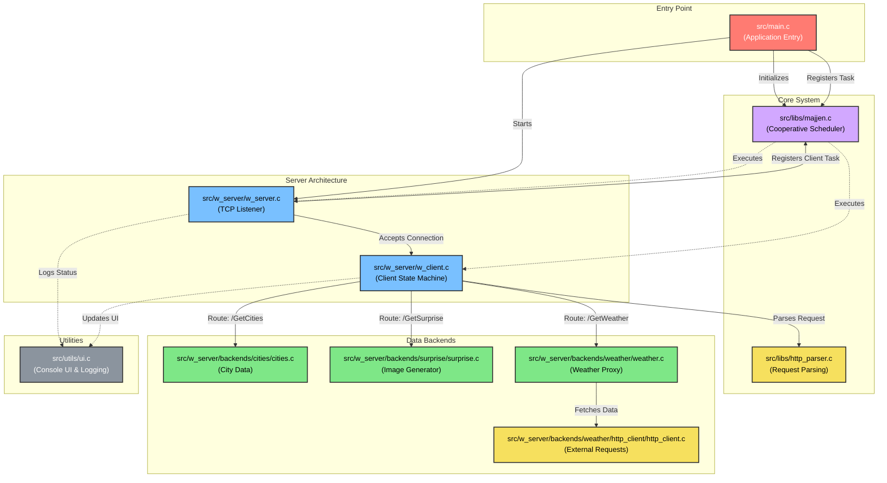

```mermaid
graph TD
    %% Define Color Palette
    classDef entry fill:#ff7b72,stroke:#333,stroke-width:2px,color:white;
    classDef core fill:#d2a8ff,stroke:#333,stroke-width:2px,color:black;
    classDef server fill:#79c0ff,stroke:#333,stroke-width:2px,color:black;
    classDef backend fill:#7ee787,stroke:#333,stroke-width:2px,color:black;
    classDef util fill:#8b949e,stroke:#333,stroke-width:2px,color:white;
    classDef lib fill:#f6e05e,stroke:#333,stroke-width:2px,color:black;

    subgraph "Entry Point"
        Main["src/main.c<br/>(Application Entry)"]:::entry
    end

    subgraph "Core System"
        Scheduler["src/libs/majjen.c<br/>(Cooperative Scheduler)"]:::core
        HTTP_Parser["src/libs/http_parser.c<br/>(Request Parsing)"]:::lib
    end

    subgraph "Server Architecture"
        WServer["src/w_server/w_server.c<br/>(TCP Listener)"]:::server
        WClient["src/w_server/w_client.c<br/>(Client State Machine)"]:::server
    end

    subgraph "Data Backends"
        Cities["src/w_server/backends/cities/cities.c<br/>(City Data)"]:::backend
        Surprise["src/w_server/backends/surprise/surprise.c<br/>(Image Generator)"]:::backend
        Weather["src/w_server/backends/weather/weather.c<br/>(Weather Proxy)"]:::backend
        HTTP_Client["src/w_server/backends/weather/http_client/http_client.c<br/>(External Requests)"]:::lib
    end

    subgraph "Utilities"
        UI["src/utils/ui.c<br/>(Console UI & Logging)"]:::util
    end

    %% Main Flow
    Main -->|Initializes| Scheduler
    Main -->|Starts| WServer
    Main -->|Registers Task| Scheduler

    %% Server Logic
    WServer -->|Accepts Connection| WClient
    WServer -->|Registers Client Task| Scheduler
    WServer -.->|Logs Status| UI

    %% Client Processing
    WClient -->|Parses Request| HTTP_Parser
    WClient -.->|Updates UI| UI
    
    %% Routing
    WClient -->|Route: /GetCities| Cities
    WClient -->|Route: /GetSurprise| Surprise
    WClient -->|Route: /GetWeather| Weather

    %% Backend Logic
    Weather -->|Fetches Data| HTTP_Client
    
    %% Scheduler Control
    Scheduler -.->|Executes| WServer
    Scheduler -.->|Executes| WClient
```
